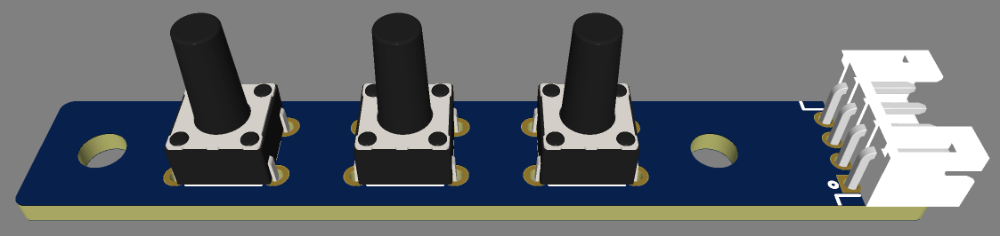
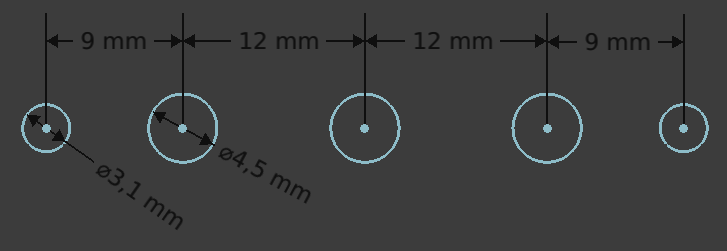

# Fightstick aux buttons PCB

This is a design for a small PCB containing three tactile pushbutton switches. It's intended for use as menu buttons in a fightstick, but can be used for any number of things. A 4-pin JST-PH connector can be used to connect this to other circuits. It occupies a footprint of about 8×50 mm on the control panel, but the physical size is 10×60 mm (more like 10×70 mm if you account for connecting something to the JST).

The buttons and connections are labeled on the bottom side of the PCB. The buttons are connected to a common ground, marked `G` next to the appropriate pin on the JST.

The PCB is designed to mount under the control panel on a pair of 6 mm spacers (it has two 3.2 mm holes that can accept an M3 thread). The switches are roughly 9 mm tall, so mounting the PCB this way will allow the switches to protrude from the top of a control panel that is less than 3 mm thick. The mounting holes and switches are all in one line. The distance between the mounting holes and switches is 9 mm, and the distance between switches is 12 mm (all these dimensions are centre to centre). The switches need a hole with a diameter of at least 4.5 mm. See the diagram below for recommended panel cutouts.

The design assumes the use of Omron B3F-1070 switches, but any pushbutton in the common 6×6 mm footprint should work, assuming it's tall enough. (The JST-PH connector sits on the same side of the PCB as the switches, which is why spacers & tall buttons are necessary.)

These have been manufactured (by JLCPCB) but **not yet tested for electrical soundness**. Manufacture at your own risk.

This project was designed using EasyEDA.
